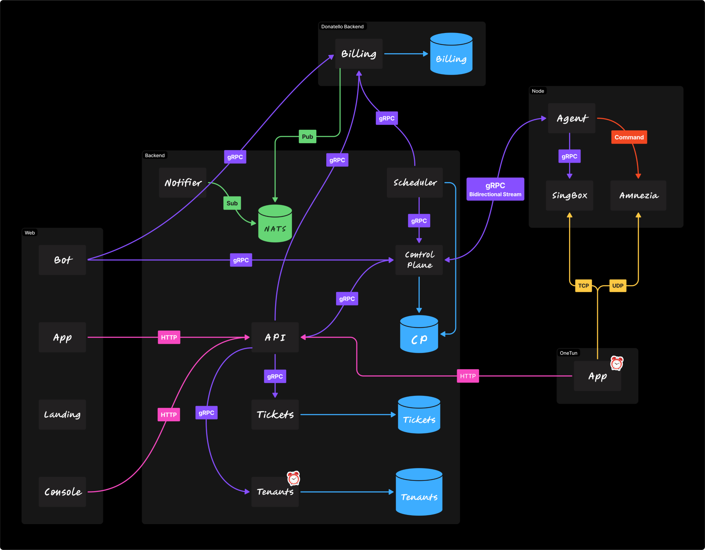

    

Distributed proxy service with centralized management and scalable edge nodes.

---

## 🏗️ High-Level Architecture

<picture>
  <source media="(prefers-color-scheme: dark)" srcset="../assets/dark-diagram.png">
  <source media="(prefers-color-scheme: light)" srcset="../assets/light-diagram.png">
  
</picture>

---
### Credits
Badges by [shields.io](https://shields.io).
