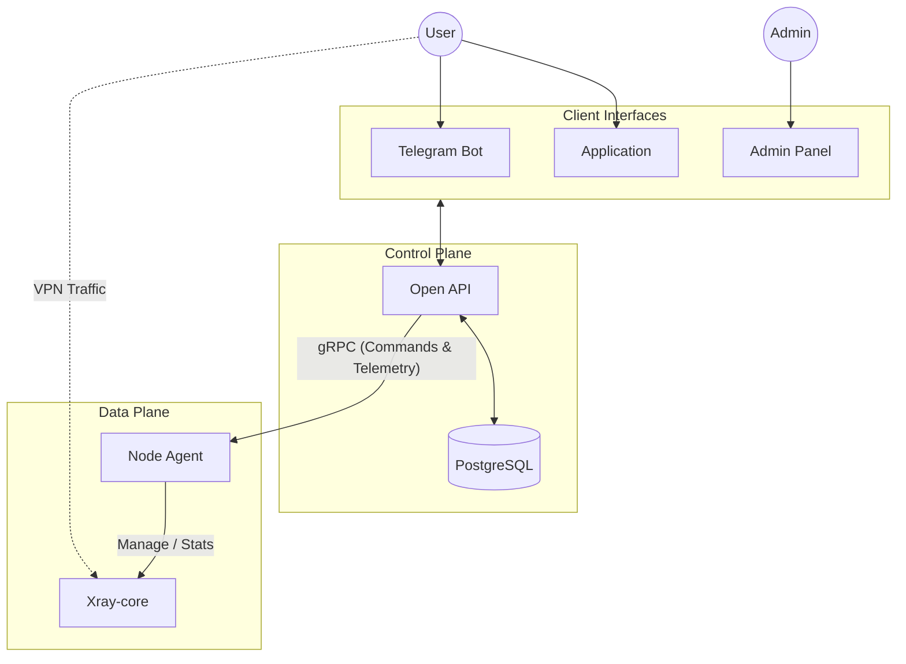

    

Distributed proxy service with centralized management and scalable edge nodes.

---

## 🏗️ High-Level Architecture

The system architecture is based on the **Separation of Control and Data Plane** principle. This decoupling allows for a highly resilient central management system and horizontally scalable edge nodes.

# 🧩 System Components

| Layer             | Module           | Description                                                                                                                      | Status                                                                              |
|:------------------|------------------|:---------------------------------------------------------------------------------------------------------------------------------|:------------------------------------------------------------------------------------|
| **Control Plane** | **Open API**     | API for user management and node orchestration.                                                                      |  |
| **Control Plane** | **Telegram Bot** | Interface for subscriptions and account management.                                                                            |          |
| **Data Plane**    | **Node Agent**   | Manages local Xray instances and reports stats.                                                                                  |          |
| **Data Plane**    | **Xray-core**    | Proxy engine for traffic routing and obfuscation.                                                               |           |
| **Management**    | **Admin Panel**             | Dashboard for admin tasks and system status.                                                                                     |          |

---
### Credits
Badges by [shields.io](https://shields.io).